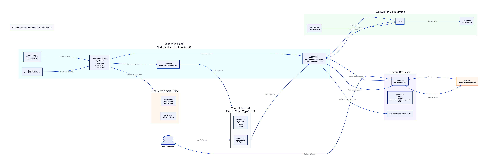

# Office Energy Dashboard

Real-time device monitoring and power insights for a simulated smart office.

## Short Overview

Office Energy Dashboard helps identify and reduce unnecessary electricity usage from office lights and fans that are left ON.

The system monitors exactly 3 rooms and 15 simulated electrical devices:

- Drawing Room
- Work Room 1
- Work Room 2

Each room has exactly 2 fans and 3 lights, for a total of 6 fans, 9 lights, and 15 devices.

Users can:

- Monitor all devices from a live web dashboard.
- See total and per-room power usage.
- View active alerts.
- Toggle simulated devices from the dashboard.
- Pause or resume the backend automatic simulator.
- Ask a Discord bot for live status and usage.
- Optionally use a Wokwi ESP32 simulation where DIP switch changes can toggle backend devices and app toggles can update Wokwi LEDs.

The Node.js backend is the single source of truth for device state. The frontend, Discord bot, and optional Wokwi simulation all read or update that shared backend state.

## Live Demo Links

| Part | Link |
|---|---|
| Frontend Dashboard | https://techathon-preli.vercel.app |
| Backend API | https://techathon-preli-backend.onrender.com/api/status |
| Wokwi ESP32 1: Drawing Room + Work Room 1 lights | https://wokwi.com/projects/468623413487903745 |
| Wokwi ESP32 2: Work Room 1 fans + Work Room 2 | https://wokwi.com/projects/468625223899644929 |
| Demo Video / Drive Folder | https://drive.google.com/drive/folders/1T-_1PHwZAHxMWa-s-FVs2VFn1AlGv8Vh?usp=sharing |
| GitHub Repository | https://github.com/irfanAbir1231/techathon-preli.git |

## Key Features

- Real-time dashboard
- Exactly 15 simulated office devices
- 3 room layout
- Live total power usage
- Per-room power usage
- Active alerts
- Manual device toggles
- Backend simulator pause/resume control
- Socket.IO live updates
- Discord bot commands
- Optional Groq-polished Discord responses
- Wokwi ESP32 simulated hardware integration
- Render backend deployment
- Vercel frontend deployment

The frontend power trend is a live browser-session trend only. The backend does not currently store persistent historical analytics or daily kWh history.

## System Architecture

The backend owns the final device state. The frontend does not own or calculate the source-of-truth state, and the Discord bot reads the same state as the dashboard.

System diagram:



Text flow:

```text
Wokwi ESP32 simulated hardware layer, optional
        <-> REST API
Render Node.js backend
        <-> REST + Socket.IO
Vercel React dashboard
        <->
Discord bot reads same backend state
```

Architecture diagram:

```text
[Wokwi ESP32 Simulation]
          <->
[Render Backend: Express + Socket.IO + Simulator]
          /                         \
[Vercel Web Dashboard]        [Discord Bot + Groq polish]
```

Important architecture notes:

- Backend owns all device state.
- Frontend uses REST for initial data and actions.
- Frontend listens to the Socket.IO event `dashboard-update`.
- Discord commands read the same backend/simulation state.
- Wokwi is optional and communicates with the backend through REST.
- The included `diagram.png` shows the current integrated system flow.

## Tech Stack

### Backend

- Node.js
- Express
- Socket.IO
- dotenv
- cors
- discord.js
- groq-sdk

### Frontend

- React
- Vite
- TypeScript
- React Router
- Socket.IO Client
- Lucide React
- Recharts
- CSS glassmorphism styling
- Vitest
- React Testing Library

### Deployment

- Render for persistent backend
- Vercel for frontend

### Hardware Simulation

- Wokwi
- ESP32 DevKit
- LEDs representing fans/lights
- DIP switches as simulated wall switches
- ArduinoJson
- WiFi / HTTPClient

## Project Structure

```text
.
|-- server.js
|-- simulation.js
|-- bot.js
|-- bot.test.js
|-- package.json
|-- package-lock.json
|-- .env.example
|-- frontend/
|   |-- package.json
|   |-- vite.config.ts
|   |-- vercel.json
|   |-- src/
|   |-- public/
|   `-- README.md
`-- README.md
```

## Environment Variables

### Backend `.env`

Create a `.env` file in the repository root:

```env
PORT=5000
DISCORD_TOKEN=
DISCORD_ALERT_CHANNEL_ID=
GROQ_API_KEY=
CORS_ORIGIN=http://localhost:5173
TZ=Asia/Dhaka
```

Notes:

- `DISCORD_TOKEN` is required for the Discord bot.
- `DISCORD_ALERT_CHANNEL_ID` is optional for proactive alert messages.
- `GROQ_API_KEY` is optional. Discord fallback responses still work without it.
- `CORS_ORIGIN` should point to the frontend URL.
- `TZ=Asia/Dhaka` is important so office-hour alerts use Bangladesh time.

### Frontend `frontend/.env.local`

For local backend:

```env
VITE_API_BASE_URL=http://localhost:5000
VITE_SOCKET_URL=http://localhost:5000
```

For deployed backend:

```env
VITE_API_BASE_URL=https://techathon-preli-backend.onrender.com
VITE_SOCKET_URL=https://techathon-preli-backend.onrender.com
```

Security note: never commit real `.env` files or secrets.

## Running Locally

### Backend

From the repository root:

```bash
npm install
npm run dev
```

Or:

```bash
npm start
```

Expected backend:

```text
http://localhost:5000
```

Test:

```bash
curl http://localhost:5000/api/status
```

### Frontend

Before starting the frontend, create `frontend/.env.local`:

```env
VITE_API_BASE_URL=http://localhost:5000
VITE_SOCKET_URL=http://localhost:5000
```

Then run:

```bash
cd frontend
npm install
npm run dev
```

Expected frontend:

```text
http://localhost:5173
```

If using the deployed backend while running the frontend locally, set both `VITE_` variables to:

```text
https://techathon-preli-backend.onrender.com
```

## Discord Bot Setup and Usage

### Setup

1. Create a Discord application in the Discord Developer Portal.
2. Create a bot.
3. Enable Message Content Intent.
4. Invite the bot to the server using the OAuth2 `bot` scope.
5. Give permissions:
   - View Channels
   - Send Messages
   - Read Message History
6. Add `DISCORD_TOKEN` to the backend `.env` file or Render environment variables.
7. Add `DISCORD_ALERT_CHANNEL_ID` if proactive alerts should be posted.
8. Restart or redeploy the backend.
9. The bot should show online when the backend is running.

### Commands

| Command | Purpose |
|---|---|
| `!help` | Shows available commands. |
| `!status` | Shows overall office status. |
| `!room drawing` | Shows Drawing Room status. |
| `!room work1` | Shows Work Room 1 status. |
| `!room work2` | Shows Work Room 2 status. |
| `!usage` | Shows current total and per-room live power usage. |

Room aliases such as `!room work room 1`, `dr`, `wr1`, and `wr2` may also work.

Important: the bot reports current live watts only. It does not report fake daily kWh unless backend storage is added later.

If `GROQ_API_KEY` is configured, Groq may polish response wording. If Groq is missing, fails, times out, or changes facts, deterministic fallback responses still work.

## Wokwi / ESP32 Simulation Setup and Usage

Wokwi projects:

| ESP32 Board | Coverage | Link |
|---|---|---|
| ESP32 1 | Drawing Room + Work Room 1 lights | https://wokwi.com/projects/468623413487903745 |
| ESP32 2 | Work Room 1 fans + Work Room 2 | https://wokwi.com/projects/468625223899644929 |

The Wokwi simulation is an optional hardware simulation layer. It demonstrates how an ESP32-based office device system could connect to the same backend.

It uses:

- ESP32 DevKit
- LEDs as simulated lights/fans
- DIP switch bank as simulated wall switches
- REST calls to the deployed backend

Behavior:

- App/dashboard toggle -> backend changes -> Wokwi polls backend -> LED changes.
- DIP switch movement -> ESP32 sends `POST /api/device/toggle` -> backend changes -> dashboard/Discord update.

### DIP Switch Behavior

The DIP switch position is not treated as the final ON/OFF truth. Each DIP switch movement is treated as a toggle event because the current backend endpoint is `POST /api/device/toggle`.

Example:

- If a device is OFF and the DIP switch position changes, the ESP32 sends a toggle request and the device turns ON.
- If the same DIP switch changes again, the ESP32 sends another toggle request and the device turns OFF.
- If the app changes a device state, the physical DIP switch position will not move automatically.
- Therefore, the DIP position may not always visually match the current app state.
- The backend remains the source of truth.

### Timing Notes

- Dashboard/app -> Wokwi LED update may take a few seconds because the ESP32 polls `/api/status` periodically.
- Wokwi DIP switch -> dashboard update also depends on HTTPS request time and Render response time.
- Wait 2-5 seconds after toggling before judging the result.
- If Render is waking from sleep, the first response can be slower.

### Recommended Usage Steps

1. Open the deployed dashboard.
2. Open one or both Wokwi projects.
3. Start the Wokwi simulation for the board you want to demo.
4. Wait for Serial Monitor to show backend connected or synced from backend.
5. Toggle a device from the dashboard.
6. Wait a few seconds and observe the corresponding Wokwi LED change.
7. Move a DIP switch in Wokwi.
8. Wait a few seconds and observe the dashboard/Discord state update.

Serial Monitor messages may include:

- Wi-Fi connected
- Backend connected. Online mode active.
- Synced from backend
- DIP switch changed
- Backend toggled
- Backend command successful

Troubleshooting Wokwi:

- If the LED does not change immediately, wait a few seconds.
- If Serial Monitor shows backend offline, Render may be waking up.
- Refreshing or restarting Wokwi can help.
- The simulation uses HTTPS to Render, so small delays are normal.
- DIP switches are toggle inputs, not absolute ON/OFF controls.

This repository does not currently include Wokwi source files. The two linked Wokwi projects are split by board responsibility:

- ESP32 1 handles Drawing Room devices and Work Room 1 lights.
- ESP32 2 handles Work Room 1 fans and Work Room 2 devices.

## API Reference

Base URL for deployed backend:

```text
https://techathon-preli-backend.onrender.com
```

### `GET /api/status`

Returns the current master snapshot:

- `officeState`
- `totalPowerUsage`
- `roomPowerUsage`
- `alerts`
- `simulation`
- `updatedAt`

The `simulation` field is non-breaking and includes:

```json
{
  "isRunning": true,
  "intervalMs": 15000,
  "lastTick": "ISO timestamp or null"
}
```

### `GET /api/room/:roomName`

Examples:

```text
/api/room/drawing
/api/room/work1
/api/room/work2
```

Invalid room names return a JSON error with valid room options.

### `POST /api/device/toggle`

Body:

```json
{
  "id": "DR_L1"
}
```

This endpoint toggles the device. It does not set an absolute ON/OFF state.

### `GET /api/simulation`

Returns automatic simulator state:

```json
{
  "isRunning": true,
  "intervalMs": 15000,
  "lastTick": "ISO timestamp or null"
}
```

### `POST /api/simulation/pause`

Pauses the automatic 15-second random simulation loop. Manual toggles and alert detection still work.

### `POST /api/simulation/resume`

Resumes the automatic 15-second random simulation loop.

### `POST /api/simulation/toggle`

Toggles between paused and running simulator states.

## Real-Time Socket.IO Event

Event name:

```text
dashboard-update
```

Payload:

```text
Same shape as GET /api/status.
```

The frontend listens to `dashboard-update` to update without a page refresh. The event is emitted after automatic simulation changes, manual toggles, simulation pause/resume changes, and alert changes.

## Alert Logic

Current alert rules:

- Device ON outside office hours.
- Room where all devices stay ON too long.
- Development/test condition for device ON longer than 5 minutes, if implemented.

Office hours:

```text
9:00 AM - 5:00 PM
```

Timezone:

```text
TZ=Asia/Dhaka
```

Alerts are active-state alerts and may resolve or disappear when the condition is no longer true.

## Testing and Quality Checks

### Backend

```bash
npm test
node --check server.js
node --check simulation.js
node --check bot.js
```

### Frontend

```bash
cd frontend
npm run lint
npm run test
npm run build
```

### Manual Checks

- `/api/status` returns 15 devices.
- Dashboard loads.
- Socket status becomes Live.
- Manual toggle works.
- Simulation pause/resume works.
- Discord commands work.
- Wokwi sync works with a short delay.
- No wrong after-hours alerts during Bangladesh office hours.

## Deployment Notes

### Backend on Render

- Root directory: repository root
- Build command: `npm install`
- Start command: `npm start`
- Environment variables:
  - `DISCORD_TOKEN`
  - `DISCORD_ALERT_CHANNEL_ID`
  - `GROQ_API_KEY`
  - `CORS_ORIGIN=https://techathon-preli.vercel.app`
  - `TZ=Asia/Dhaka`

### Frontend on Vercel

- Root directory: `frontend`
- Framework: Vite
- Build command: `npm run build`
- Output directory: `dist`
- Environment variables:
  - `VITE_API_BASE_URL=https://techathon-preli-backend.onrender.com`
  - `VITE_SOCKET_URL=https://techathon-preli-backend.onrender.com`

## Known Limitations

- No persistent database yet.
- Device state is in-memory on the backend.
- Power trend is live-session only in the browser.
- Daily kWh history is not stored yet.
- Wokwi DIP switches send toggle events, not absolute state.
- App changes do not physically move DIP switch positions.
- Render free-tier cold starts can cause initial delays.
- Wokwi/backend sync may take a few seconds.

## Troubleshooting

### Frontend Cannot Connect

- Check `VITE_API_BASE_URL` and `VITE_SOCKET_URL`.
- Check that the Render backend is awake.
- Check `CORS_ORIGIN` on the backend.

### Discord Bot Offline

- Check `DISCORD_TOKEN`.
- Check Message Content Intent.
- Check Render logs.
- Redeploy backend.

### Wrong After-Hours Alerts

- Check `TZ=Asia/Dhaka` in the backend environment.

### Wokwi Not Syncing

- Check Serial Monitor.
- Wait for backend connected or synced from backend.
- Confirm `BASE_URL` points to the Render backend.
- Wait 2-5 seconds after toggles.
- Remember DIP switch movement sends toggle, not absolute ON/OFF.

## Demo Flow

Suggested 3-minute demo:

1. Show dashboard homepage.
2. Point out 3 rooms and 15 devices.
3. Toggle a device from the dashboard.
4. Show live power update.
5. Show the simulation pause/resume control.
6. Show alert panel.
7. Show Discord:
   - `!status`
   - `!room work1`
   - `!usage`
8. Show Wokwi:
   - App toggle changes Wokwi LED.
   - DIP switch movement changes backend/dashboard.
9. Explain architecture:
   - Wokwi / simulator -> backend -> dashboard + Discord.

Demo video / shared drive folder:

```text
https://drive.google.com/drive/folders/1T-_1PHwZAHxMWa-s-FVs2VFn1AlGv8Vh?usp=sharing
```

## Security Notes

- Do not commit `.env` files.
- Rotate Discord/Groq keys if exposed.
- `.env.example` contains placeholders only.
- Frontend only uses `VITE_` variables and must not contain secrets.

## Future Improvements

- Add persistent database.
- Add daily kWh history.
- Add cost estimation.
- Add an absolute set-state endpoint for real latching switches.
- Add role-based dashboard auth.
- Add richer Discord commands.
- Add more realistic current/power sensors in Wokwi.
- Add full schematic images in `docs/`.
